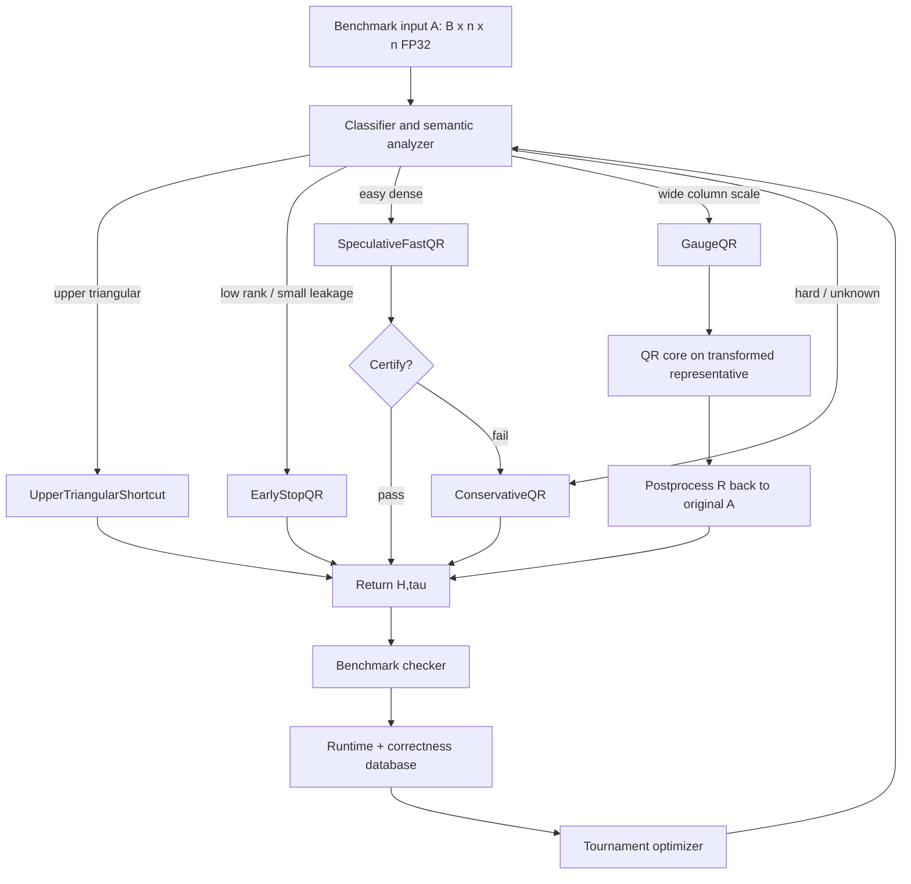
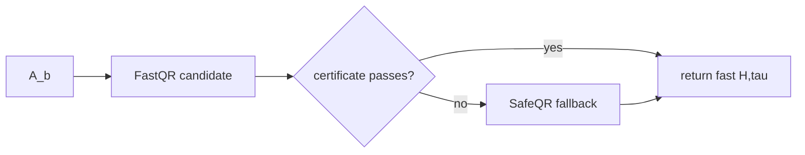
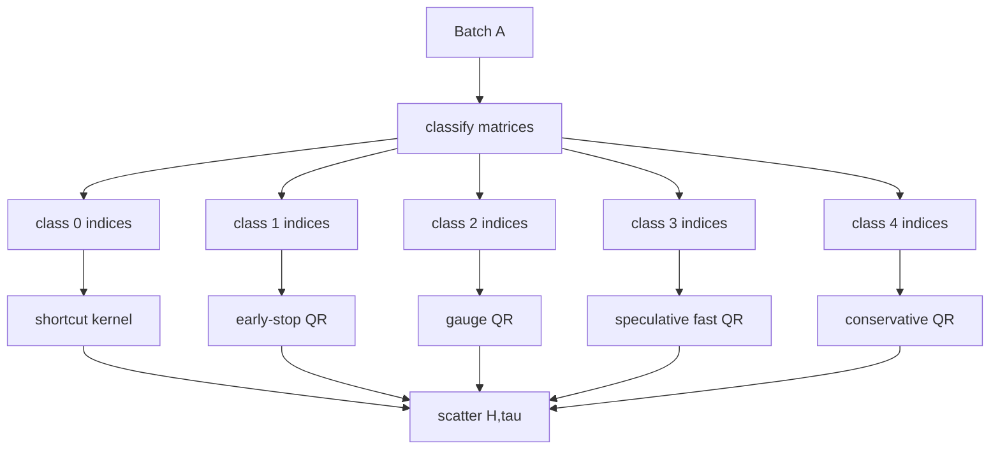
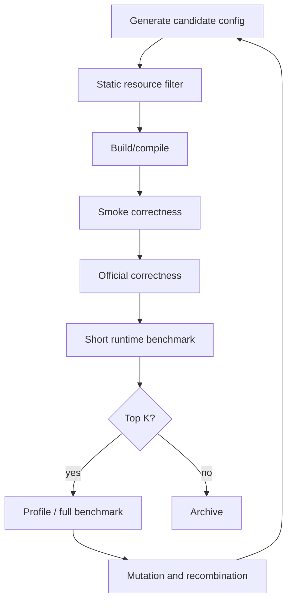

# Semantic Work-Reduction Search for Batched Compact-Householder QR

**A technical proposal and implementation plan for breaking past the current B200 leaderboard frontier**

---

## 0. Executive thesis

The current leading direction appears to be **empirical program search** over QR implementations. To beat a strong search system, do not merely search the same backend/kernel space harder. Add new axes that an ordinary code-mutating searcher is unlikely to invent:

> Search for ways to do **less QR**, not merely faster QR.

The key observation is that the benchmark does not require reproducing a specific LAPACK trajectory. It requires returning a valid compact-Householder witness `(H, tau)` for the original FP32 input `A`.

Define the checker relation:

$$
\operatorname{ValidCompactQR}(A,H,\tau)
$$

where:

$$
Q = \operatorname{householder\_product}(H,\tau),
\qquad
R = \operatorname{triu}(H),
$$

and the checker accepts when:

$$
R \approx Q^\top A,
\qquad
Q^\top Q \approx I.
$$

The proposed system searches programs that preserve this relation while reducing work. The most promising new operators are:

1. **Tolerance-aware early termination**: stop after enough reflectors if the remaining lower-triangular leakage is below the benchmark tolerance.
2. **Speculative fast path + certifier + fallback**: run aggressive tensor-core or approximate variants on easy matrices, rerun only failures conservatively.
3. **Per-matrix mixed-batch routing and compaction**: avoid forcing easy and hard matrices through the same path.
4. **Right-gauge transformations**: factor a better representative `B = A U`, then map the triangular factor back to `A`.
5. **Structural shortcuts**: upper-triangular identity QR, exact zero-tail reflector pruning, low-rank and support-aware paths.
6. **Residual-budget allocation**: treat the checker tolerance as a scarce optimization resource.

This proposal is not a full categorical compiler and not a single hand-tuned kernel. It is a **semantic candidate generator + backend tournament** whose candidates are designed to exploit the checker relation.

---

## 1. Strategic context

A strong participant already appears to be running an asynchronous optimize-tree/program-search manager: multiple workers, many failures, a best-candidate lineage, and a rising performance frontier. The leaderboard gap suggests that this search has found a genuinely competitive family, not just a minor local tweak.

Therefore the winning counter-strategy should be:

```text
current leader likely has: backend/program search
we should add: semantic work-reduction operators
```

A generic code searcher may mutate tile sizes, dispatch rules, CUDA kernels, and library calls. It is much less likely to invent a new semantic rule such as:

```text
It is legal to stop QR early if the remaining lower leakage is already
below the checker tolerance, because the remaining reflectors can be identities.
```

or:

```text
It is legal to factor A * U for upper-triangular invertible U, then push U^{-1}
back into the returned R factor.
```

Those operators enlarge the candidate family in a way ordinary kernel mutation does not.

---

## 2. The semantic target

The benchmark target is a relation, not a fixed function.

### 2.1 Compact-Householder witness relation

For input:

$$
A \in \mathbb{F}_{32}^{B \times n \times n},
$$

we must return:

$$
H \in \mathbb{F}_{32}^{B \times n \times n},
\qquad
\tau \in \mathbb{F}_{32}^{B \times n}.
$$

For each batch item:

$$
Q = \operatorname{householder\_product}(H,\tau),
\qquad
R = \operatorname{triu}(H).
$$

The output is valid if:

$$
\frac{\lVert R - Q^\top A \rVert_1}{\lVert A \rVert_1}
\le
\rho_R(n),
$$

and:

$$
\frac{\lVert Q^\top Q - I \rVert_1}{\lVert I \rVert_1}
\le
\rho_Q(n),
$$

where the challenge uses FP32-relative tolerances of the form:

$$
\rho_R(n) \approx 20 n \epsilon_{32},
\qquad
\rho_Q(n) \approx 100 n \epsilon_{32}.
$$

The exact constants should be imported from the benchmark harness, not duplicated by hand.

### 2.2 Witness search objective

Let:

$$
\mathcal{F}(A) = \{(H,\tau) \mid \operatorname{ValidCompactQR}(A,H,\tau)\}.
$$

The compiler/searcher is a witness selector:

$$
g : A \mapsto (H,\tau) \in \mathcal{F}(A).
$$

For candidate family $\mathcal{G}$ and benchmark distribution $\mathcal{B}$, the objective is:

$$
g^* = \arg\min_{g \in \mathcal{G}_{\mathrm{pass}}}
\exp\left(
\frac{1}{|\mathcal{B}|}
\sum_{b \in \mathcal{B}}
\log t_b(g)
\right),
$$

subject to:

$$
\forall A \in \mathcal{B},\quad \operatorname{ValidCompactQR}(A,g(A)).
$$

This is a precise optimization target. It is not “write the best hand-tuned QR kernel.”

---

## 3. Architecture overview



The system has two search layers:

```text
semantic search:
  Which valid-witness strategy should be used?

backend search:
  How should the selected strategy be realized on B200?
```

Do not let backend search swamp semantic search. The thesis is that the largest remaining gains may come from semantic work reduction.

---

## 4. Candidate grammar

### 4.1 Semantic program grammar

```text
SemanticProgram ::=
    ConservativeQR(QRCore)
  | UpperTriangularShortcut
  | ExactZeroReflectorPrune(QRCore)
  | EarlyStopQR(QRCore, StopRule)
  | GaugeQR(Gauge, QRCore)
  | SpeculateFastThenFallback(FastQR, Certifier, SafeQR)
  | MixedBatchRouter(Classifier, {Class -> SemanticProgram})
```

### 4.2 Gauge grammar

```text
Gauge ::=
    Identity
  | Pow2ColumnDiagonal
  | PanelPow2ColumnDiagonal(nb)
  | ClusterScaleDiagonal
  | BoundedPanelUpperTriangular   # later; high risk/high complexity
```

### 4.3 QR core grammar

```text
QRCore ::=
    VendorCuSolver
  | VendorCuSolverDx
  | BlockedWY(nb, PanelImpl, UpdateImpl, VStrategy, NumericMode)

nb ::= 16 | 32 | 48 | 64 | 96 | 128

PanelImpl ::=
    CustomCTA
  | CustomWarpSpecialized
  | CuSolverDxPanel
  | HybridPanel

UpdateImpl ::=
    CuBLASLt
  | CUTLASSMaterializedV
  | CUTLASSImplicitV
  | CustomCUDA

VStrategy ::=
    MaterializedV
  | ImplicitVFromH
  | PackedV

NumericMode ::=
    FP32Strict
  | FP32FastMath
  | TF32Speculative
  | MixedSpeculative
```

### 4.4 Dispatch search space

The final submission should be a property-aware dispatch portfolio, not one universal kernel.

```text
DispatchKey :=
  n,
  batch,
  upper_triangular_flag,
  effective_rank_bucket,
  column_scale_span_bucket,
  bandedness_bucket,
  zero_tail_rate_bucket,
  matrix_case_if_known_or_inferred
```

---

## 5. Avenue 1: tolerance-aware early termination

This is the highest-upside idea.

### 5.1 Mathematical validity

After applying the first $r$ Householder reflectors, suppose:

$$
Q_r^\top A =
\begin{bmatrix}
R_{11} & R_{12} \\
0      & E
\end{bmatrix}.
$$

If we stop here and set the remaining reflectors to identity:

$$
\tau_r = \tau_{r+1} = \cdots = \tau_{n-1} = 0,
$$

then the compact product is still orthogonal:

$$
Q = Q_r.
$$

The returned triangular factor is:

$$
R = \operatorname{triu}(Q_r^\top A)
  =
\begin{bmatrix}
R_{11} & R_{12} \\
0      & \operatorname{triu}(E)
\end{bmatrix}.
$$

The factor residual is:

$$
R - Q_r^\top A
=
-
\operatorname{strictlower}(E).
$$

Therefore, early stopping is valid whenever:

$$
\lVert \operatorname{strictlower}(E) \rVert_1
\le
\alpha \rho_R(n) \lVert A \rVert_1,
$$

where $0 < \alpha < 1$ is a safety margin.

### 5.2 Why it can be massive

Full square Householder QR has work approximately:

$$
W(n) \approx \frac{4}{3} n^3.
$$

If we stop after $r$ columns, the work is roughly:

$$
W(r;n) \approx \frac{4}{3}\left(n^3 - (n-r)^3\right),
$$

up to implementation constants and blocking overhead. For $r \ll n$, this behaves like:

$$
W(r;n) = O(rn^2).
$$

The approximate retained work fraction is:

$$
\frac{W(r;n)}{W(n)}
\approx
1 - \left(1 - \frac{r}{n}\right)^3.
$$

Examples:

| $r/n$ | retained work | ideal speedup ceiling |
| ----: | ------------: | --------------------: |
|  1/16 |         17.6% |                  5.7x |
|   1/8 |         33.0% |                  3.0x |
|   1/4 |         57.8% |                  1.7x |
|   1/2 |         87.5% |                  1.1x |

The structured stress cases include rank-deficient and near-rank-deficient matrices. If those cases permit early termination at small $r$, this can dominate any tile-size improvement.

### 5.3 Early-stop algorithm

```text
for each matrix b:
    active[b] = true
    normA[b] = matrix_l1_norm(A[b])
    threshold[b] = alpha * rtol(n) * normA[b]

for k in 0, nb, 2*nb, ...:
    factor/update panel k only for active matrices

    for each active matrix b:
        leakage[b] = l1_norm_strictlower(H[b, k+nb:n, k+nb:n])

        if leakage[b] <= threshold[b]:
            tau[b, k+nb:n] = 0
            mark inactive[b] = false

    compact active matrix list

    if no active matrices:
        break
```

### 5.4 CUDA-oriented design

Kernels:

```text
compute_matrix_l1_norm_kernel
panel_qr_active_kernel
trailing_update_active_kernel
early_stop_leakage_kernel
compact_active_indices_kernel
set_remaining_tau_zero_kernel
```

Use active-index arrays:

```cpp
int* active_indices;      // current active matrices
int  active_count;
int* stopped_at_panel;    // diagnostic and dispatch stats
```

Use prefix sums or CUB for compaction:

```text
flags[b] = still_active ? 1 : 0
exclusive_scan(flags) -> positions
scatter active b into new_active_indices
```

### 5.5 Feasibility experiment before optimizing kernels

Build a slow prototype first:

```python
def early_stop_feasibility(A, nb_values=(16, 32, 64), alpha_values=(0.25, 0.5, 0.75)):
    for nb in nb_values:
        # run panel-by-panel QR using torch/geqrf-like logic or a reference implementation
        # after each panel, measure strict-lower leakage in the remaining trailing block
        # record first panel satisfying the checker-derived threshold
        ...
```

Required output:

```text
case, n, batch, nb, alpha,
median_stop_k, p90_stop_k, max_stop_k,
pass_rate_if_stopped, theoretical_work_saved
```

Decision rule:

```text
If rankdef/nearrank/clustered/mixed have median_stop_k <= n/4,
implement optimized active-list early termination immediately.
```

---

## 6. Avenue 2: speculative fast path + certifier + fallback

### 6.1 Concept

Run a fast but riskier path first. Certify it cheaply. Fallback only for matrices that fail certification.



This allows aggressive modes on easy matrices without forcing hard matrices through the same risky implementation.

### 6.2 Fast-path candidates

```text
FP32 panel + TF32/tensor-core trailing updates
pow2-scaled fast QR
larger block size nb=64/96/128
implicit-V CUTLASS update
skipped tiny reflectors under a residual budget
fast-math FP32 update
```

### 6.3 Certificates

Possible certificates, from cheapest to strongest:

1. **Structural certificate**: no NaNs/Infs, norms within bounds, no suspicious scale explosion.
2. **Leakage certificate**: strict lower-triangular leakage in the maintained transformed matrix is below budget.
3. **Incremental error certificate**: bound estimated arithmetic error from update mode and scaling.
4. **Spot-check certificate**: sample columns/rows of $Q^\top A - R$.
5. **Full residual certificate**: compute checker-equivalent residual. Strong but often too expensive.

The early implementation should use structural + leakage certificates, backed by full offline validation on official cases.

### 6.4 Risk

For approximate trailing updates, the stored Householder vectors define $Q$, but the maintained transformed matrix may drift from the exact $Q^\top A$. A leakage-only certificate is not a full proof of the residual. Therefore:

```text
competition path:
  use empirical validation and fallback heuristics

formal path:
  use exact/FP32 updates or prove a usable error bound
```

This is acceptable if the benchmark input distribution is fixed and validation is exhaustive over official visible cases, but it should be treated as a risk for hidden cases.

---

## 7. Avenue 3: per-matrix mixed-batch routing and compaction

The mixed case is heterogeneous by design. A global branch such as “this batch is easy” is invalid. But per-matrix routing is valid and likely valuable.

### 7.1 Classifier

Compute per matrix:

```text
upper-triangular leakage before QR
matrix L1 norm
column norm span
zero column count
estimated rank bucket
band/support width
near-collinearity score
exact zero-tail opportunities observed during panel QR
```

### 7.2 Routing

```text
class 0: upper triangular                  -> shortcut
class 1: low-rank / early-stop candidate   -> EarlyStopQR
class 2: scale-clustered                   -> GaugeQR + fast path
class 3: easy dense                         -> SpeculativeFastQR
class 4: hard                               -> ConservativeQR
```

### 7.3 Batch compaction

Do not simply branch inside one kernel. Compact by class:

```text
classify -> prefix-sum -> gather indices by class -> run specialized kernels -> scatter outputs
```



This is an execution model a generic code searcher may not discover unless exposed as a primitive.

---

## 8. Avenue 4: right-gauge transformations

### 8.1 The legal transformation

Let:

$$
U \in \operatorname{UT}_n^\times,
\qquad
B = A U.
$$

If:

$$
B = Q R_B,
$$

then:

$$
A = B U^{-1} = Q R_B U^{-1}.
$$

Because $R_B$ and $U^{-1}$ are upper triangular:

$$
R_A = R_B U^{-1}
$$

is also upper triangular. Therefore the same Householder vectors and `tau` from the QR of $B$ produce a valid compact witness for $A$ after replacing the upper triangle with $R_A$.

### 8.2 First practical subset: power-of-two diagonal gauge

Let:

$$
D = \operatorname{diag}(d_1,\dots,d_n),
\qquad
B = A D.
$$

Choose:

$$
s_j = \max_i |A_{ij}|,
$$

and:

$$
d_j = 2^{-\operatorname{round}(\log_2 s_j)},
$$

with guards for zero, subnormal, infinity, and overflow.

Then factor:

$$
B = Q R_B.
$$

Return:

$$
R_A = R_B D^{-1}.
$$

In compact storage:

```text
H.lower = H_B.lower
H.upper[:, j] = H_B.upper[:, j] / d_j
tau = tau_B
```

### 8.3 Why this matters

By itself, diagonal scaling is only $O(Bn^2)$ overhead and does not reduce asymptotic QR work. Its value is that it can make fast or speculative paths pass more often:

```text
wide column-scale cases  -> more balanced panel norms
clustered-scale cases    -> lower numeric risk
TF32/mixed update paths  -> more likely to satisfy residual
near-rank cases          -> more reliable early-stop certificates
```

### 8.4 Implementation kernels

```text
compute_column_scales_kernel
scale_columns_pow2_kernel
unscale_upper_triangle_kernel
```

For power-of-two scaling, store exponents instead of floats:

```cpp
int8_t* col_exp;   // d_j = 2^{col_exp[j]}
```

Unscale by exponent arithmetic where possible.

---

## 9. Avenue 5: structural shortcuts

### 9.1 Upper-triangular shortcut

If:

$$
A = \operatorname{triu}(A),
$$

then:

$$
Q = I,
\qquad
R = A.
$$

Return:

```text
H = A
tau = 0
```

If aliasing is permitted and safe:

```text
H may alias A
```

otherwise copy only once.

For approximately upper-triangular inputs, shortcut only if:

$$
\lVert \operatorname{strictlower}(A) \rVert_1
\le
\alpha \rho_R(n) \lVert A \rVert_1.
$$

Then set:

```text
H = triu(A) with lower arbitrary or zero
tau = 0
```

This is a tolerance-aware shortcut. Use a conservative safety margin.

### 9.2 Exact zero-tail reflector pruning

In Householder generation for active vector:

$$
x = [\alpha; y],
$$

if:

$$
\lVert y \rVert_2 = 0,
$$

then the reflector is identity:

```text
tau = 0
skip normalization
skip update contribution
```

This is exact and safe. Approximate thresholding should be handled only under residual-budget accounting.

### 9.3 Zero-column and zero-block handling

If an entire remaining column block is zero under the active transform, skip panel work and set corresponding `tau` to zero.

This can occur in rank-deficient or structured synthetic cases.

---

## 10. Avenue 6: residual-budget allocation

Treat tolerance as an optimization resource.

The checker allows a residual budget:

$$
\mathcal{B}_R = \rho_R(n) \lVert A \rVert_1.
$$

Allocate it across sources:

$$
\mathcal{B}_R
\ge
\mathcal{E}_{\mathrm{early-stop}}
+
\mathcal{E}_{\mathrm{mixed-update}}
+
\mathcal{E}_{\mathrm{scaling}}
+
\mathcal{E}_{\mathrm{skipped-reflectors}}
+
\mathcal{E}_{\mathrm{rounding-margin}}.
$$

Policies:

```text
dense/easy:
  spend budget on faster update arithmetic

rankdef/nearrank:
  spend budget on early termination leakage

clustered-scale:
  spend budget on gauge/scaling and fast path

hard fallback:
  spend no budget; use conservative FP32
```

This turns the checker tolerance into an optimizer input instead of a passive acceptance threshold.

---

## 11. Implementation plan

### Phase 0: reproduce and instrument baseline

**Goal:** establish a full correctness and measurement harness.

Deliverables:

```text
catqr(A) -> H,tau PyTorch extension
cuSOLVER/cuSolverDx baseline dispatch
official checker integration
per-case timing
per-case residual/orthogonality/lower-leakage diagnostics
CSV log of all runs
```

Required metrics:

```text
runtime_us
residual_norm
orthogonality_norm
lower_leakage_norm
matrix_norm
nan_count
fallback_count
stop_panel
candidate_id
```

### Phase 1: semantic feasibility analysis

**Goal:** determine whether semantic work reduction exists in the benchmark distribution.

Experiments:

1. Early-stop feasibility.
2. Upper-triangular and approximate-upper-triangular frequency.
3. Effective-rank proxy distribution.
4. Column-scale span distribution.
5. Banded/support width distribution.
6. Zero-tail reflector frequency.

Output table:

```text
case,n,batch,
upper_triangular_rate,
approx_upper_triangular_rate,
median_stop_k,p90_stop_k,
column_scale_span_median,
zero_tail_rate,
estimated_speedup_ceiling
```

Decision gate:

```text
If no semantic slack exists, focus on backend tournament.
If any case shows large slack, implement that semantic operator first.
```

### Phase 2: upper-triangular and approximate-upper shortcut

**Goal:** capture near-free structured-case wins.

Implement:

```text
strictlower_l1_kernel
upper_triangular_shortcut_kernel
batched route/scatter support
```

Acceptance:

```text
passes all upper-triangular stress cases
never misroutes hard matrices
measurable improvement on structured cases
```

### Phase 3: early-stop QR prototype

**Goal:** implement safe per-matrix early termination.

Start with conservative path:

```text
blocked QR core with nb=32
leakage measured after each block
stop only when leakage <= 0.25 * residual_threshold
remaining tau set to zero
```

Do not optimize active compaction yet. First prove correctness and measure stop rates.

Acceptance:

```text
passes all official cases
reports stop_panel per matrix
improves rankdef/nearrank/clustered or mixed cases
```

### Phase 4: active-list compaction

**Goal:** turn early-stop correctness into runtime savings.

Implement:

```text
active_indices array
compact_active_indices_kernel or CUB scan
panel/update kernels consume active indices
scatter outputs remain in original batch order
```

Acceptance:

```text
runtime decreases proportional to stopped matrices
mixed batch handles each matrix independently
no major overhead on dense cases
```

### Phase 5: speculative fast path

**Goal:** use aggressive backends only where they pass.

Candidates:

```text
FastQR_1 = FP32 panel + TF32-like update
FastQR_2 = pow2 gauge + larger nb
FastQR_3 = implicit-V CUTLASS update
```

Certificates:

```text
no NaN/Inf
scale within bounds
lower leakage below budget
optional sampled residual
```

Fallback:

```text
ConservativeQR
```

Acceptance:

```text
fast path pass rate high on dense/easy cases
fallback rate high on hard cases but correctness preserved
geomean improves
```

### Phase 6: diagonal gauge QR

**Goal:** make hard-scale cases easier and improve fast-path pass rate.

Implement:

```text
pow2 column scale
QR of scaled representative
R upper unscale
```

Search options:

```text
global per-matrix scaling
panel-local scaling
scale clipping range
apply gauge only for scale_span >= threshold
```

Acceptance:

```text
helps clustered/column-scaled/mixed cases
or increases speculative fast-path pass rate enough to matter
```

### Phase 7: backend tournament integration

**Goal:** combine semantic candidates with backend variants.

Use adaptive racing:

```text
round 1: correctness smoke tests
round 2: official correctness suite
round 3: short benchmark reps
round 4: keep top K per shape/property class
round 5: full benchmark geomean
```

Candidate key:

```json
{
  "semantic": "EarlyStopQR",
  "classifier": "RankRiskV2",
  "qr_core": "BlockedWY",
  "nb": 32,
  "panel": "CustomCTA",
  "update": "CUTLASSImplicitV",
  "numeric": "FP32Strict",
  "stop_alpha": 0.25
}
```

### Phase 8: final portfolio freezing

**Goal:** produce a stable submission.

Freeze:

```text
dispatch table
classifier thresholds
candidate IDs
workspace sizes
CUDA Graph capture behavior
fallback paths
```

Final validation:

```text
many random seeds if generator known
all official cases
stress variants around thresholds
repeated runtime measurements
fallback correctness checks
```

---

## 12. Tournament optimizer design

### 12.1 Candidate evaluation pipeline



### 12.2 Scoring

Correctness is a hard gate:

$$
\operatorname{valid}(c) =
\bigwedge_{A \in \mathcal{B}}
\operatorname{ValidCompactQR}(A,c(A)).
$$

Runtime score:

$$
\operatorname{score}(c) =
\exp\left(
\frac{1}{m}
\sum_{i=1}^m \log t_i(c)
\right).
$$

Use per-case and per-class leaderboards, not just global geomean:

```text
best_overall
best_n512_dense
best_n512_rankdef
best_n512_mixed
best_n1024_nearrank
best_upper_triangular
best_fallback_large_n
```

This prevents global winners from hiding local opportunities.

### 12.3 Mutation operators

Backend mutations:

```text
nb changes
update backend swap
V materialization toggle
panel implementation swap
numeric mode toggle
workspace layout change
```

Semantic mutations:

```text
add/remove early stop
change stop_alpha
add gauge before fast path
change classifier threshold
add fallback
change active compaction frequency
```

Semantic mutations should be first-class. They are the differentiator.

---

## 13. Kernels and modules

```text
semantic_analyzer.cu
  compute_l1_norms
  strictlower_l1
  column_scale_stats
  upper_triangular_flags
  rank_risk_proxy

routing.cu
  classify_matrices
  compact_by_class
  scatter_outputs

qr_core.cu
  panel_geqr2_active
  larft_active
  trailing_update_active
  set_tau_zero_tail

gauge.cu
  compute_pow2_column_gauge
  scale_columns
  unscale_upper_triangle

fastpath.cu
  speculative_qr_driver
  certificate_kernels
  fallback_driver

vendor_wrappers.cpp/cu
  cusolver_geqrf
  cusolverdx_geqrf
  cublaslt_update
  cutlass_update

tournament/
  enumerate.py
  build.py
  run_correctness.py
  run_benchmark.py
  analyze_failures.py
  mutate.py
  freeze_dispatch.py
```

---

## 14. Pseudocode: final runtime driver

```cpp
QRResult catqr(const Tensor& A) {
    Shape shape = inspect_shape(A);
    Workspace& ws = workspace_cache.get(shape);

    Analysis analysis = analyze_matrices(A, ws);

    ClassBuckets buckets = classify_and_compact(A, analysis, ws);

    QRResult out = allocate_or_alias_outputs(A, shape, ws);

    if (buckets.upper_triangular.count > 0) {
        run_upper_triangular_shortcut(A, out, buckets.upper_triangular, ws);
    }

    if (buckets.early_stop.count > 0) {
        run_early_stop_qr(A, out, buckets.early_stop, ws, selected_core(shape));
    }

    if (buckets.gauge_fast.count > 0) {
        run_gauge_speculative_qr_with_fallback(
            A, out, buckets.gauge_fast, ws,
            selected_fast_core(shape),
            selected_safe_core(shape));
    }

    if (buckets.easy_fast.count > 0) {
        run_speculative_qr_with_fallback(
            A, out, buckets.easy_fast, ws,
            selected_fast_core(shape),
            selected_safe_core(shape));
    }

    if (buckets.hard.count > 0) {
        run_conservative_qr(A, out, buckets.hard, ws, selected_safe_core(shape));
    }

    return out;
}
```

---

## 15. Risk register

| Risk                                          |                  Impact | Mitigation                                                                 |
| --------------------------------------------- | ----------------------: | -------------------------------------------------------------------------- |
| Early-stop certificate too conservative       |              no speedup | tune `alpha`; use exact checker-derived norm; measure feasibility first    |
| Early-stop certificate too aggressive         |     correctness failure | strong safety margin; full validation; fallback to conservative stop rules |
| Active compaction overhead dominates          | slowdown on dense cases | only enable after stop rate threshold; route dense directly                |
| Mixed-precision fast path fails hidden cases  |        correctness risk | classify hard cases conservatively; fallback; keep FP32 as default         |
| Gauge scaling improves accuracy but not speed |     no leaderboard gain | use only when it increases fast-path pass rate                             |
| Full residual certification too expensive     |             loses speed | use leakage/structural certs plus offline validation; restrict fast path   |
| Classifier overfits visible cases             |          hidden failure | use conservative thresholds; random stress generation                      |
| Batch splitting increases launch overhead     |                slowdown | CUDA Graphs; fuse routing kernels; process only high-value classes         |
| Vendor fallback too slow for large n          |            geomean loss | profile; replace only if custom path beats it                              |
| Search explodes                               |             wasted time | two-level search; keep semantic grammar small; adaptive racing             |

---

## 16. What to test first

Do not start with a new CUTLASS kernel. First answer these empirical questions:

1. **How often can each case stop early?**
2. **How many matrices in mixed batches are structurally easy?**
3. **Does power-of-two scaling increase pass rate of fast QR variants?**
4. **Does active-list compaction produce real runtime savings?**
5. **Which benchmark cases dominate geomean sensitivity near the current frontier?**

Suggested first experiment table:

| Experiment                                    |      Time | Decision                                |
| --------------------------------------------- | --------: | --------------------------------------- |
| Early-stop feasibility in Python/reference QR | 0.5–1 day | whether to implement active early-stop  |
| Upper-triangular shortcut detection           |   0.5 day | whether shortcut matters                |
| Column-scale/gauge pass-rate study            | 0.5–1 day | whether gauge enables fast path         |
| Routing overhead microbenchmark               |   0.5 day | whether per-matrix compaction is viable |
| Baseline portfolio timing                     |     1 day | where to focus backend work             |

---

## 17. Expected path to sub-2ms and possibly sub-0.5ms

A conventional QR core may not get from the current frontier to sub-0.5ms by tile tuning alone. The needed gains likely require one or more work-reduction mechanisms:

```text
rankdef/nearrank:  early termination
mixed:             per-matrix routing
clustered-scale:   gauge + speculative fast path
upper-triangular:  shortcut/alias
dense/easy:        tensor-core-heavy speculative path
```

The path to sub-2ms is likely:

```text
backend portfolio + shape dispatch + optimized n=512/n=1024 QR
```

The path to sub-0.5ms, if reachable, is more likely:

```text
semantic work reduction
+ fast speculative paths
+ property-aware mixed-batch routing
+ fallback only for genuinely hard matrices
```

---

## 18. Final recommendation

Build a **semantic work-reduction tournament**:

```text
Semantic candidate generator
  early stop
  shortcut
  gauge
  speculate/fallback
  per-matrix routing

Backend tournament
  vendor baselines
  blocked WY
  cuBLASLt/CUTLASS updates
  active-list kernels
  CUDA Graphs

Judge
  official correctness gate
  per-case diagnostics
  geometric mean runtime
  failure taxonomy
```

The leader likely already has backend/program search. To beat them, add concepts their search probably lacks:

```text
1. stop doing QR when the checker already has enough triangularity;
2. route each matrix in mixed batches by its own semantic class;
3. use valid witness transformations to make fast paths pass;
4. spend the residual tolerance deliberately;
5. fallback only when a matrix proves it is hard.
```

That is the highest-upside implementation plan for unlocking massive gains beyond the current leaderboard frontier.
